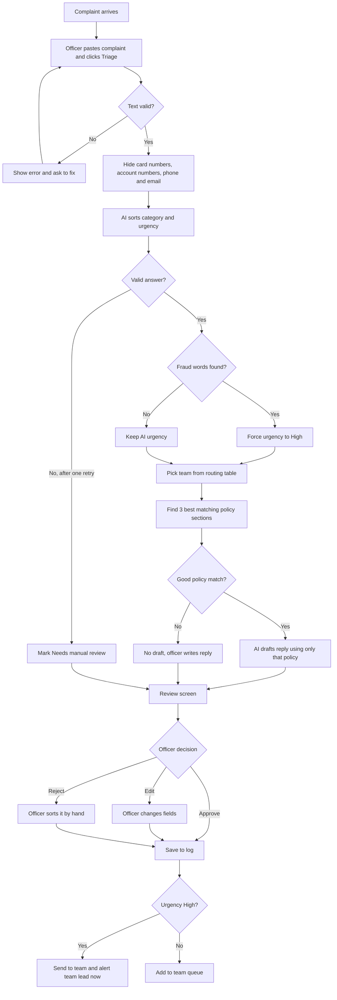

# Process Flow
## Complaint Triage Assistant for Retail Banking

**Author:** Samiha Tasnim Diba
**Version:** 0.1 (draft)

This shows the full path of one complaint, from the moment it arrives to the moment it reaches the right team. GitHub shows this as a diagram automatically.

## Key Points

* **A person decides every time.** The AI only suggests. Nothing moves until the officer approves, edits or rejects.
* **Fraud is handled by a fixed rule, not only by the AI.** Even if the AI gets it wrong, fraud words always raise urgency to High.
* **Team routing uses a table, not the AI.** This makes it predictable and easy to check.
* **No good policy, no draft.** The system would rather say nothing than make up a policy.
